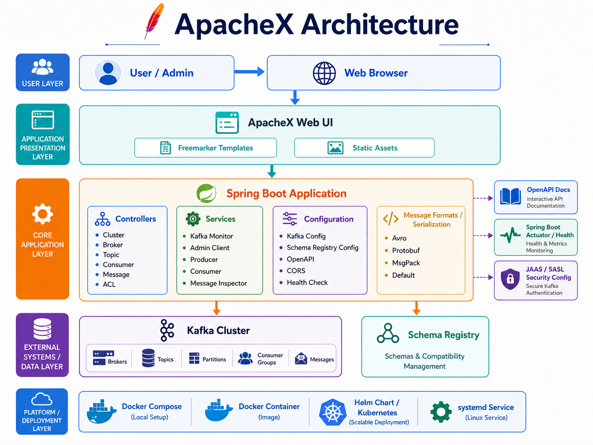
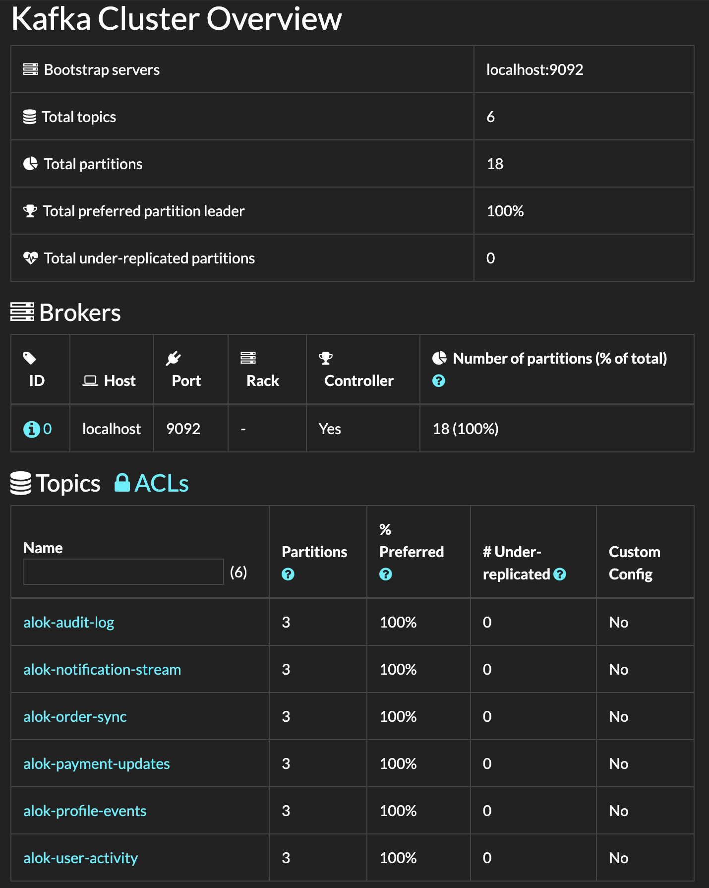

# ApacheX

ApacheX is a Spring Boot based web UI for monitoring and managing Apache Kafka clusters. It helps developers and operators inspect brokers, topics, partitions, consumer groups, ACLs, and Kafka messages from a clean browser interface.

## Features

- View Kafka cluster summary, brokers, topics, partitions, and replication details
- Browse topic messages with support for plain text, JSON, Avro, Protobuf, and MessagePack formats
- Inspect consumer groups, committed offsets, partition lag, and topic subscriptions
- Create and delete Kafka topics from the UI when enabled
- Publish messages to Kafka topics when message sending is enabled
- View Kafka ACL information
- Connect to secured Kafka clusters using SASL, SSL/TLS, truststores, keystores, and custom Kafka properties
- Integrate with Schema Registry for Avro and Protobuf message decoding
- Expose JSON APIs and OpenAPI/Swagger documentation
- Deploy with JAR, Docker, Docker Compose, systemd, or Helm/Kubernetes

## Preview





## Tech Stack

| Category | Technology |
|---|---|
| Language | Java 21 |
| Backend Framework | Spring Boot 3, Undertow |
| Messaging | Apache Kafka, Spring Kafka, Kafka Admin Client |
| UI Templates | Freemarker, Bootstrap theme assets |
| API Documentation | Springdoc OpenAPI, Swagger UI |
| Message Formats | JSON, Avro, Protobuf, MessagePack |
| Build Tool | Maven Wrapper, Maven Compiler Plugin targeting Java 21 |
| Containerization | Docker, Docker Compose |
| Deployment | Helm, Kubernetes, systemd |
| Monitoring | Spring Boot Actuator |
| Logging | Log4j2 |
| Testing | JUnit, Spring Boot Test, Testcontainers Kafka |

## Project Structure

```text
ApacheX/
├── .github/
│   ├── linters/
│   │   └── .ecrc
│   ├── workflows/
│   │   ├── close_inactive_issues.yml
│   │   ├── main.yml
│   │   └── pull_request.yml
│   └── dependabot.yml
├── .mvn/
│   └── wrapper/
│       └── maven-wrapper.properties
├── chart/
│   ├── templates/
│   │   ├── _helpers.tpl
│   │   ├── deployment.yaml
│   │   ├── ingress.yaml
│   │   ├── NOTES.txt
│   │   └── service.yaml
│   ├── Chart.yaml
│   └── values.yaml
├── contrib/
│   └── systemd/
│       ├── ApacheX.service
│       └── start.sh
├── docker-compose/
│   └── kafka-ApacheX/
│       └── docker-compose.yaml
├── images/
│   ├── architecture.png
│   └── kafka_cluster.png
├── src/
│   ├── main/
│   │   ├── assembly/
│   │   │   └── bin.xml
│   │   ├── docker/
│   │   │   ├── ApacheX.sh
│   │   │   └── Dockerfile
│   │   ├── java/
│   │   │   └── ApacheX/
│   │   │       ├── config/
│   │   │       ├── controller/
│   │   │       ├── form/
│   │   │       ├── model/
│   │   │       ├── service/
│   │   │       ├── util/
│   │   │       └── ApacheX.java
│   │   └── resources/
│   │       ├── static/
│   │       │   ├── css/
│   │       │   ├── fonts/
│   │       │   ├── images/
│   │       │   └── js/
│   │       ├── templates/
│   │       │   ├── includes/
│   │       │   ├── lib/
│   │       │   ├── acl-overview.ftlh
│   │       │   ├── broker-detail.ftlh
│   │       │   ├── cluster-overview.ftlh
│   │       │   ├── consumer-detail.ftlh
│   │       │   ├── error.ftlh
│   │       │   ├── message-inspector.ftlh
│   │       │   ├── not-initialized.ftlh
│   │       │   ├── search-message.ftlh
│   │       │   ├── topic-create.ftlh
│   │       │   ├── topic-detail.ftlh
│   │       │   └── topic-messages.ftlh
│   │       ├── application.yml
│   │       ├── log4j.properties
│   │       ├── log4j2.properties
│   │       └── messages.properties
│   └── test/
│       ├── java/
│       │   └── ApacheX/
│       │       ├── controller/
│       │       ├── kafka/
│       │       ├── model/
│       │       ├── protos/
│       │       ├── util/
│       │       ├── AbstractIntegrationTest.java
│       │       ├── ApacheXIT.java
│       │       ├── ApacheXTest.java
│       │       ├── LocalRunner.java
│       │       └── SendKafkaProtoPayload.java
│       └── resources/
│           ├── person.desc
│           ├── person.proto
│           └── sasl-ssl.properties
├── theme/
│   ├── _bootswatch.scss
│   ├── _variables.scss
│   └── install.sh
├── .editorconfig
├── .gitignore
├── kaas_local_jaas.conf
├── LICENSE
├── mvnw
├── mvnw.cmd
├── pom.xml
└── README.md
```

## Prerequisites

- Java 21 or newer
- Maven 3.8+ or the included Maven wrapper
- Apache Kafka cluster or local Kafka setup
- Docker and Docker Compose, only for container-based setup
- Helm and Kubernetes, only for Kubernetes deployment

## Getting Started

### 1. Clone the Repository

```bash
git clone https://github.com/alokpriyadarshii/ApacheX.git
cd ApacheX
```

### 2. Build the Project

Using Maven wrapper:

```bash
./mvnw clean package
```

Or using local Maven:

```bash
mvn clean package
```

### 3. Run the Application

```bash
java --add-opens=java.base/sun.nio.ch=ALL-UNNAMED \
  -jar target/ApacheX-4.2.1-SNAPSHOT.jar \
  --kafka.brokerConnect=localhost:9092
```

Open the application in your browser:

```text
http://localhost:9000
```

If `kafka.brokerConnect` is not provided, the application defaults to `localhost:9092`.

## Run with Docker

```bash
docker run -d --rm \
  -p 9000:9000 \
  -e KAFKA_BROKERCONNECT=host.docker.internal:9092 \
  -e SERVER_SERVLET_CONTEXTPATH=/ \
  obsidiandynamics/apachex
```

Then open:

```text
http://localhost:9000
```

## Run with Docker Compose

A sample Docker Compose setup is available with Kafka and ApacheX.

```bash
cd docker-compose/kafka-ApacheX
docker compose up
```

Access the UI at:

```text
http://localhost:9000
```

## Kubernetes Deployment with Helm

```bash
helm upgrade -i ApacheX chart \
  --set kafka.brokerConnect=<kafka-host:9092> \
  --set server.servlet.contextPath=/
```

Default service port:

```text
9000
```

Default NodePort from the chart:

```text
30900
```

## Important Configuration

| Property / Environment Variable | Purpose | Default |
|---|---|---|
| `kafka.brokerConnect` / `KAFKA_BROKERCONNECT` | Kafka bootstrap servers | `localhost:9092` |
| `server.port` / `SERVER_PORT` | Web server port | `9000` |
| `management.server.port` / `MANAGEMENT_SERVER_PORT` | Actuator port | `9000` |
| `server.servlet.context-path` / `SERVER_SERVLET_CONTEXTPATH` | App context path | `/` |
| `schemaregistry.connect` / `SCHEMAREGISTRY_CONNECT` | Schema Registry URL | Not set |
| `schemaregistry.auth` / `SCHEMAREGISTRY_AUTH` | Schema Registry basic auth | Not set |
| `message.format` | Default message value format | `DEFAULT` |
| `message.keyFormat` | Default message key format | Uses value format |
| `message.sendEnabled` | Enables message publishing | `false` |
| `topic.createEnabled` | Enables topic creation | `true` |
| `topic.deleteEnabled` | Enables topic deletion | `true` |
| `cors.enabled` | Enables CORS headers | `true` |
| `SSL_ENABLED` | Enables HTTPS for the UI | `false` |

## Secure Kafka Connection

For SASL/SSL Kafka clusters, create a `kafka.properties` file:

```properties
security.protocol=SASL_SSL
sasl.mechanism=SCRAM-SHA-512
sasl.jaas.config=org.apache.kafka.common.security.scram.ScramLoginModule required username="user" password="password";
```

Run the application with:

```bash
java -jar target/ApacheX-4.2.1-SNAPSHOT.jar \
  --kafka.brokerConnect=<host:port> \
  --kafka.propertiesFile=./kafka.properties
```

For Docker, mount the properties file:

```bash
docker run -d --rm \
  -p 9000:9000 \
  -v $(pwd)/kafka.properties:/tmp/kafka.properties:ro \
  -e KAFKA_BROKERCONNECT=<host:port> \
  -e KAFKA_PROPERTIES_FILE=/tmp/kafka.properties \
  obsidiandynamics/apachex
```

## Schema Registry

To decode Avro or Protobuf messages with Schema Registry:

```bash
java -jar target/ApacheX-4.2.1-SNAPSHOT.jar \
  --kafka.brokerConnect=localhost:9092 \
  --schemaregistry.connect=http://localhost:8081 \
  --message.format=AVRO
```

With basic authentication:

```bash
--schemaregistry.auth=username:password
```

## Protobuf Descriptor Support

To use local Protobuf descriptor files:

```bash
java -jar target/ApacheX-4.2.1-SNAPSHOT.jar \
  --kafka.brokerConnect=localhost:9092 \
  --message.format=PROTOBUF \
  --protobufdesc.directory=/path/to/protobuf/descriptors
```

## API Endpoints

ApacheX provides HTML views and JSON APIs. Send `Accept: application/json` to receive JSON responses.

| Endpoint | Description |
|---|---|
| `GET /` | Cluster summary with brokers and topics |
| `GET /broker` | List all brokers |
| `GET /broker/{id}` | View broker details |
| `GET /topic` | List all topics |
| `GET /topic/{name}` | View topic details |
| `POST /topic` | Create a topic |
| `POST /topic/{name}/delete` | Delete a topic |
| `GET /topic/{name}/consumers` | View consumers for a topic |
| `GET /topic/{name}/messages` | View topic messages |
| `GET /topic/{name}/allmessages` | View all latest messages from a topic |
| `POST /topic/{name}/addmessage` | Publish a message to a topic |
| `GET /topic/{name}/search-messages` | Search topic messages |
| `POST /topic/{name}/search-messages` | Search messages and return JSON |
| `GET /consumer/{groupId}` | View consumer group details |
| `GET /acl` | List Kafka ACLs |
| `GET /health_check` | Basic health check |
| `GET /actuator` | Spring Boot Actuator endpoints |
| `GET /v3/api-docs` | OpenAPI JSON documentation |
| `GET /swagger-ui.html` | Swagger UI |

## Enable Message Publishing

Message publishing is disabled by default. Enable it with:

```bash
--message.sendEnabled=true
```

## Disable Topic Creation or Deletion

```bash
--topic.createEnabled=false
--topic.deleteEnabled=false
```

## Build Docker Image Locally

```bash
mvn assembly:single docker:build
```

## Run as a systemd Service

Systemd files are available in:

```text
contrib/systemd/
```

Use them as a starting point for Linux server deployment.

## Development Notes

- Main application class: `src/main/java/ApacheX/ApacheX.java`
- Default config file: `src/main/resources/application.yml`
- UI templates: `src/main/resources/templates/`
- Static assets: `src/main/resources/static/`
- Kafka integration services: `src/main/java/ApacheX/service/`
- Serializer/deserializer utilities: `src/main/java/ApacheX/util/`
